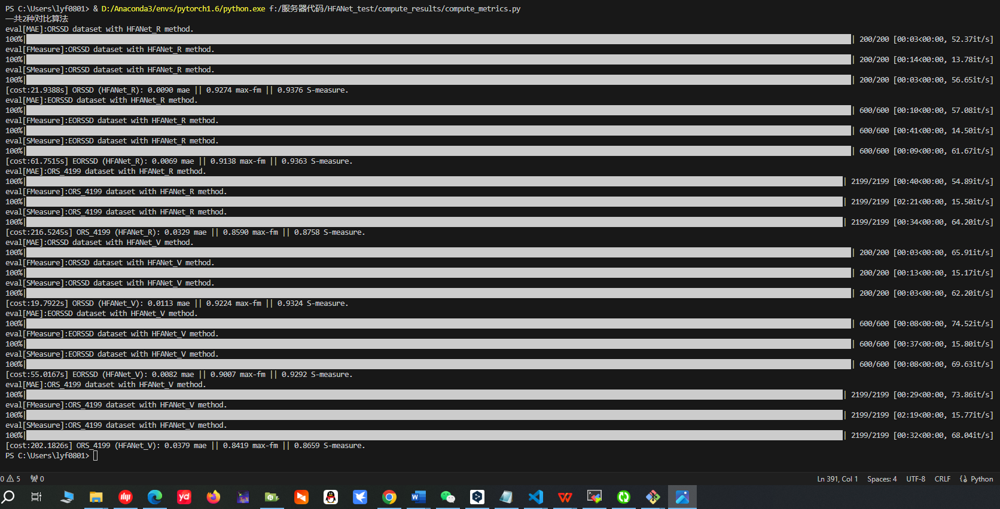

# HFANet
This repository is about the work "[**Hybrid Feature Aligned Network for Salient Object Detection in Optical Remote Sensing Imagery**](https://ieeexplore.ieee.org/abstract/document/9791375/)", in **IEEE TGRS 2022**.

# Abstract
<p style="text-align:justify; text-justify:inter-ideograph;">
Recently, salient object detection in optical remote sensing images (RSI-SOD) has attracted great attention. Benefiting from the success of deep learning and the inspiration of natural SOD task, RSI-SOD has achieved fast progress over the past two years. However, existing methods usually suffer from the intrinsic problems of optical RSIs: 1) cluttered background; 2) scale variation of salient objects; 3) complicated edges and irregular topology. To remedy these problems, we propose a hybrid feature aligned network (HFANet) jointly modeling boundary learning to detect salient objects effectively. Specifically, we design a hybrid encoder by unifying two components to capture global context for mitigating the disturbance of complex background. Then, to detect multiscale salient objects effectively, we propose a Gated Fold-ASPP (GF-ASPP) to extract abundant context in the deep semantic features. Furthermore, an adjacent feature aligned module (AFAM) is presented for integrating adjacent features with unparameterized alignment strategy. Finally, we propose a novel interactive guidance loss (IGLoss) to combine saliency and edge detection, which can adaptively perform mutual supervision of the two subtasks to facilitate detection of salient objects with blurred edges and irregular topology. Adequate experimental results on three optical RSI-SOD datasets reveal that the presented approach exceeds 18 state-of-the-art ones.
</p>

# Framework


# Experimental Results


# How to use this repository

## Directly download predicted saliency maps from zip files for comparison
```
HFANet_R_ORSSD.zip
HFANet_R_EORSSD.zip
HFANet_R_ORS_4199.zip
```
## or

```
HFANet_V_ORSSD.zip
HFANet_V_EORSSD.zip
HFANet_V_ORS_4199.zip
```

## Runing source code to generate the predicted saliency maps

### 1. Install newest versions of torch and torchdata
```python
thop                      0.0.31
tqdm                      4.59.0
numpy                     1.20.2
timm                      0.4.12
tokenizers                0.12.1
torch                     1.8.1
torchvision               0.9.1
```

### 2. Download weights files from Google Drive
<https://drive.google.com/drive/folders/1H8FO3q5_hEBQIs5a622yoL3vBnZ-sgZj?usp=drive_link>

### 3. Run getsmaps.py to generate the saliency maps
```python
python getsmaps.py
```

### 4. Run compute_metrics.py to calculate the qualititive results
```python
python compute_metrics.py  # in  ./compute_results
```


# Note: About the Attribute Analysis in our paper, we use the following function to calculate SSIM metrics. 

<center>
    
</center>


```python
def _ssim(pred, gt):
    gt = gt.float()
    h, w = pred.size()[-2:]
    N = h * w
    x = pred.mean()
    y = gt.mean()
    sigma_x2 = ((pred - x) * (pred - x)).sum() / (N - 1 + 1e-20)
    sigma_y2 = ((gt - y) * (gt - y)).sum() / (N - 1 + 1e-20)
    sigma_xy = ((pred - x) * (gt - y)).sum() / (N - 1 + 1e-20)

    aplha = 4 * x * y * sigma_xy
    beta = (x * x + y * y) * (sigma_x2 + sigma_y2)

    if aplha != 0:
        Q = aplha / (beta + 1e-20)
    elif aplha == 0 and beta == 0:
        Q = 1.0
    else:
        Q = 0
    return Q
```

Recently, we find that this function defines C1 = C2 = 0 to calculate SSIM metrics [while the original recommended C1=0.01 and C2 = 0.03](https://github.com/Shaosifan/HSENet/blob/main/codes/metric_scripts/calculate_PSNR_SSIM.py), and thus the reported variant of SSIM results is slightly different from the one recommended for calculation.

However, this slight difference does not impact the effectiveness of the experimental analysis and comparison. Thus, we maintain this setting for all subsequent work.

If you have any questions about this paper, please send an e-mail to liuyanfeng99@gmail.com.

# Citation (if possible, please cite:)
```BibTeX
@ARTICLE{HFANet2022,

  author={Wang, Qi and Liu, Yanfeng and Xiong, Zhitong and Yuan, Yuan},

  journal={IEEE Transactions on Geoscience and Remote Sensing},

  title={Hybrid Feature Aligned Network for Salient Object Detection in Optical Remote Sensing Imagery},

  year={2022},

  volume={60},

  number={},

  pages={1-15},

  doi={10.1109/TGRS.2022.3181062}

}

@ARTICLE{SDNet2023,

  author={Liu, Yanfeng and Xiong, Zhitong and Yuan, Yuan and Wang, Qi},
  
  journal={IEEE Transactions on Geoscience and Remote Sensing}, 
  
  title={Transcending Pixels: Boosting Saliency Detection via Scene Understanding From Aerial Imagery}, 
  
  year={2023},
  
  volume={61},
  
  number={},
  
  pages={1-16},

  doi={10.1109/TGRS.2023.3298661}

  }

@ARTICLE{SRAL2023,

  author={Liu, Yanfeng and Xiong, Zhitong and Yuan, Yuan and Wang, Qi},
  
  journal={IEEE Transactions on Geoscience and Remote Sensing}, 
  
  title={Distilling Knowledge From Super-Resolution for Efficient Remote Sensing Salient Object Detection}, 
  
  year={2023},
  
  volume={61},
  
  number={},
  
  pages={1-16},
  
  doi={10.1109/TGRS.2023.3267271}
  
  }

@ARTICLE{UG2L2023,

  author={Liu, Yanfeng and Yuan, Yuan and Wang, Qi},

  journal={IEEE Geoscience and Remote Sensening Letters},

  title={Uncertainty-Aware Graph Reasoning with Global Collaborative Learning for Remote Sensing Salient Object Detection},

  year={2023},

  volume={20},

  number={},

  pages={1-5},

  doi={10.1109/LGRS.2023.3299245}

}

@InProceedings{RSSOD2023,

  author = {Xiong, Zhitong and Liu, Yanfeng and Wang, Qi and Zhu, Xiao Xiang},

  title = {RSSOD-Bench: A Large-Scale Benchmark Dataset for Salient Object Detection in Optical Remote Sensing Imagery},

  booktitle = {Proc. IEEE International Geoscience and Remote Sensing Symposium (IGARSS)},

  pages={6549-6552},

  year = {2023}

}
```

# Acknowledgment and our other works
1. <https://github.com/EarthNets/Dataset4EO>
2. <https://github.com/lyf0801/UG2L>
3. <https://github.com/lyf0801/SDNet>
4. <https://github.com/lyf0801/SRAL>
5. <https://github.com/rmcong/DAFNet_TIP20>
6. <https://github.com/rmcong/EORSSD-dataset>
7. <https://github.com/rmcong/ORSSD-dataset>
